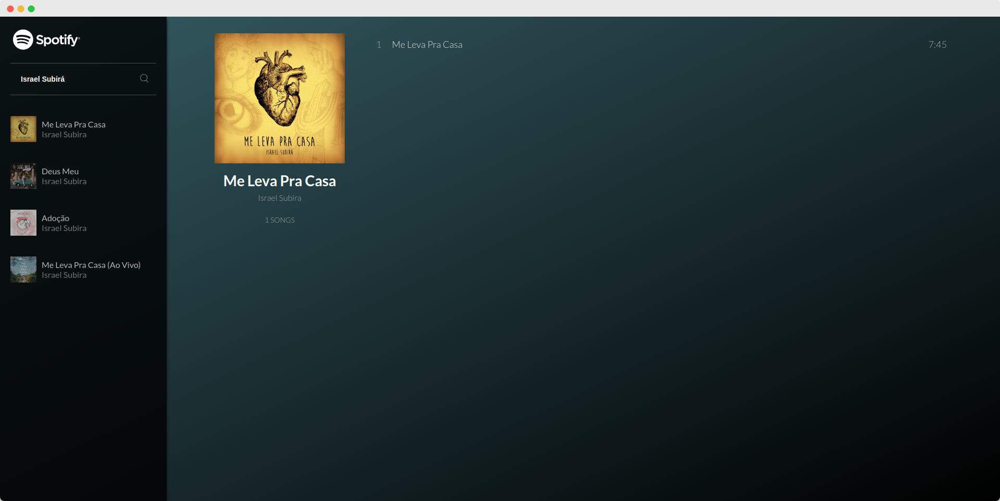

# Spotify Player

This project was developed to create an awesome example of how you can use the [simple-spotify-wrapper](https://github.com/jpedroschmitz/simple-spotify-wrapper) library.



## Getting Started

Before we get started make sure you have node and npm installed on your machine. Also, you will need to have a Spotify account.

### Install and run

1. First go to [Spotify Developers API](https://developer.spotify.com/web-api/) and create your token. Then add your token on [src/Spotify.js](src/Spotify.js). **Remember that the token will expire in 60min**
2. Once you have the token you can clone this repository.
2. Then on the project folder run `npm install` or `yarn` to get all the dependencies.
3. Use `npm start` to get the server running on [http://localhost:8080/](http://localhost:8080/).

### Testing

To run the tests you can use the following command:

```sh
npm test
```

Or if you want to test the coverage use:

```sh
npm run test:coverage
```

## Browser Support

This Application relies on [Fetch API](https://fetch.spec.whatwg.org/). And this API is supported in the following browsers.

 |  |  |  |  |
--- | --- | --- | --- | --- |
42+ ✔ | 39+ ✔ | 29+ ✔ | 10.1+ ✔ | Nope ✘ |

## Future features?

- [ ] Create authentication method to get token
- [ ] Create player buttons
- [ ] Create a similar interface to Spotify Web.

## Contributing

Please read [CONTRIBUTING.md](CONTRIBUTING.md) for details on our code of conduct, and the process for submitting pull requests.

## License

This project is licensed under the MIT License - see the [LICENSE.md](LICENSE.md) file for details.

## Authors

| |
|:---------------------:|
|  [João Pedro Schmitz](https://github.com/jpedroschmitz/)   |

